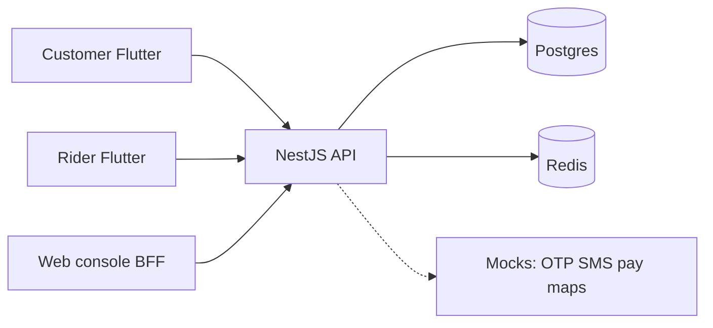

# Architecture (pilot)

One brand, one kitchen. Cheap to run; clients stay thin.

- **Source of truth:** API for price, stock, zones, cart totals, feature flags, order state, ETA, delivery OTP.
- **Admin-driven:** menu, fees, hours, capacity, support `wa.me`, placeholders for legal, `app_config` ETA/location retention.
- **Stack:** single NestJS + Postgres + Redis. No microservices until metrics force it.
- **Mocks:** OTP, payments, maps/SMS/push (notification_log) until explicitly enabled.
- **Tracking:** promised_window immutable; location throttled; OTP never on rider APIs.
- **Clients:** Flutter + Next render API; cookie BFF on web.

Details: [REQUIRED_DECISIONS.txt](REQUIRED_DECISIONS.txt) · [USER_JOURNEYS.md](USER_JOURNEYS.md) · [RUN.md](RUN.md)
